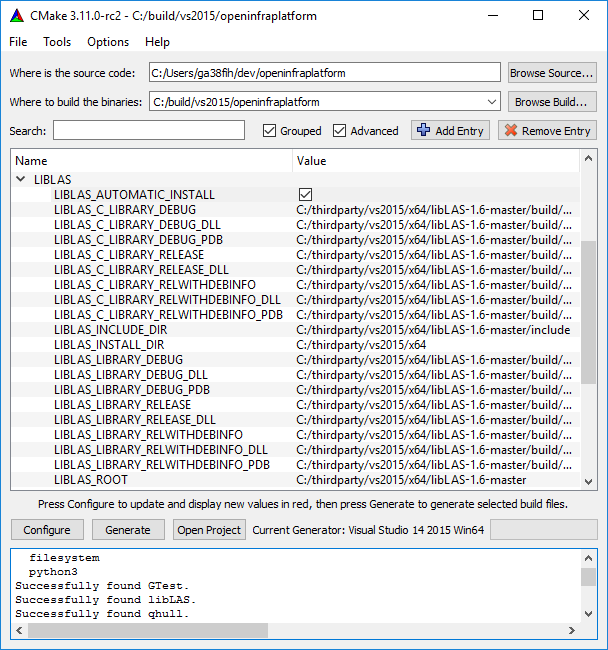

# Building

## Info

TUM Open Infra Platform is built using CMake (version 3.8 or newer is required) on x64 based systems and Microsoft Visual Studio 14 2015 or Microsoft Visual Studio 15 2017. We are currently not supporting other systems or compilers.

## Dependencies

### BlueFramework

#### Installing/Building

The rendering system for the OIP is the [BlueFramework](https://bitbucket.org/tumcms/blueframework/overview) which features a DirectX11 and DirectX12 backend. The BlueFramework library also provides other utilities. A binary installer for the latest stable release is available on the [BlueFramework](https://bitbucket.org/tumcms/blueframework/overview) bitbucket page under section "Releases". If you want to build the library yourself follow the instructions in the BlueFramework's building documentation.

#### Linking

If installed with a binary installer, the BlueFramework will be detected completely automatic by the "find_package" command in CMake. If the library is built on it's own or a ZIP installer is used, set "BlueFramework_DIR" to the root folder containing "BlueFrameworkConfig.cmake".

### OpenInfraPlatform.EarlyBinding

The early binding libraries for the Ifc formats are build in the [OpenInfraPlatform.EarlyBinding](https://bitbucket.org/hechth/openinfraplatform.earlybinding/overview) project. Scripts to download binary versions are provided under "./external/Get_OpenInfraPlatform.EarlyBinding..." for Visual Studio 2015 and 2017. Executing these will unzip the libraries to "C:\thirdparty".

### Thirdparty libraries

OIP uses boost, Qt and Eigen for which no further building instructions are listed here.

OIP depends on several smaller third party libraries such as zlib. The [percdems](http://bitbucket.org/Vertexwahn/percdems/src) contains several scripts to build the different needed libraries. For instance, building zlib for Visual Studio 2015 x64 can be done using the following batch script on Windows:

```bash
wget.exe http://zlib.net/zlib1211.zip -OC:\thirdparty\vs2015\x64\zlib-1.2.11.zip
7za.exe x C:\thirdparty\vs2015\x64\zlib-1.2.11.zip -oC:\thirdparty\vs2015\x64
del C:\thirdparty\vs2015\x64\zlib-1.2.11.zip
call "C:\Program Files (x86)\Microsoft Visual Studio 14.0\VC\vcvarsall.bat" amd64
cmake -G"Visual Studio 14 2015 Win64" -HC:\thirdparty\vs2015\x64\zlib-1.2.11 -BC:\thirdparty\vs2015\x64\zlib-1.2.11\build
C:
cd C:\thirdparty\vs2015\x64\zlib-1.2.11\build
cmake --build . --config Debug
cmake --build . --config Release
cmake --build . --config RelWithDebInfo
mkdir C:\thirdparty\vs2015\x64\zlib-1.2.11\lib
mkdir C:\thirdparty\vs2015\x64\zlib-1.2.11\bin
copy Debug\zlibd.dll C:\thirdparty\vs2015\x64\zlib-1.2.11\bin\zlibd.dll
copy Debug\zlibd.exp C:\thirdparty\vs2015\x64\zlib-1.2.11\lib\zlibd.exp
copy Debug\zlibd.ilk C:\thirdparty\vs2015\x64\zlib-1.2.11\lib\zlibd.ilk
copy Debug\zlibd.lib C:\thirdparty\vs2015\x64\zlib-1.2.11\lib\zlibd.lib
copy Debug\zlibd.pdb C:\thirdparty\vs2015\x64\zlib-1.2.11\lib\zlibd.pdb
copy Debug\zlibstaticd.lib C:\thirdparty\vs2015\x64\zlib-1.2.11\lib\zlibstaticd.lib

REM copy RelWithDebInfo\zlib.dll C:\thirdparty\vs2015\x64\zlib-1.2.11\bin\zlib.dll
REM copy RelWithDebInfo\zlib.exp C:\thirdparty\vs2015\x64\zlib-1.2.11\lib\zlib.exp
REM copy RelWithDebInfo\zlib.lib C:\thirdparty\vs2015\x64\zlib-1.2.11\lib\zlib.lib
REM copy RelWithDebInfo\zlibstatic.lib C:\thirdparty\vs2015\x64\zlib-1.2.11\lib\zlibstatic.lib

copy Release\zlib.dll C:\thirdparty\vs2015\x64\zlib-1.2.11\bin\zlib.dll
copy Release\zlib.exp C:\thirdparty\vs2015\x64\zlib-1.2.11\lib\zlib.exp
copy Release\zlib.lib C:\thirdparty\vs2015\x64\zlib-1.2.11\lib\zlib.lib
copy Release\zlibstatic.lib C:\thirdparty\vs2015\x64\zlib-1.2.11\lib\zlibstatic.lib
copy zconf.h C:\thirdparty\vs2015\x64\zlib-1.2.11\zconf.h
```

These build scripts are also contained in this repository under './external/*.cmd'. If the library is not found, the option to install this library shows up in the CMakeGUI and the corresponding script is invoked from cmake once an installation directory is specified or the default directory (C:\thirdparty\vs2015\x64\ for Visual Studio 14 2015 Win64 generator) is accepted.



The libraries which can be installed this way are libLAS, zlib, qhull, raptor2 and gtest.

